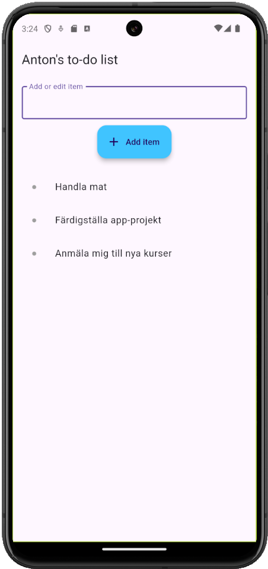

# Assignment 2 - The to-do list
## Instructions
The following are the requirements for the application:
+ Text can be entered and put in a scrollable list (that is, it should scroll when there is no more room)
+ If an item is clicked, it should be removed from the list and the text set into the text field
+ Following the above, the new text can be put last on the list

